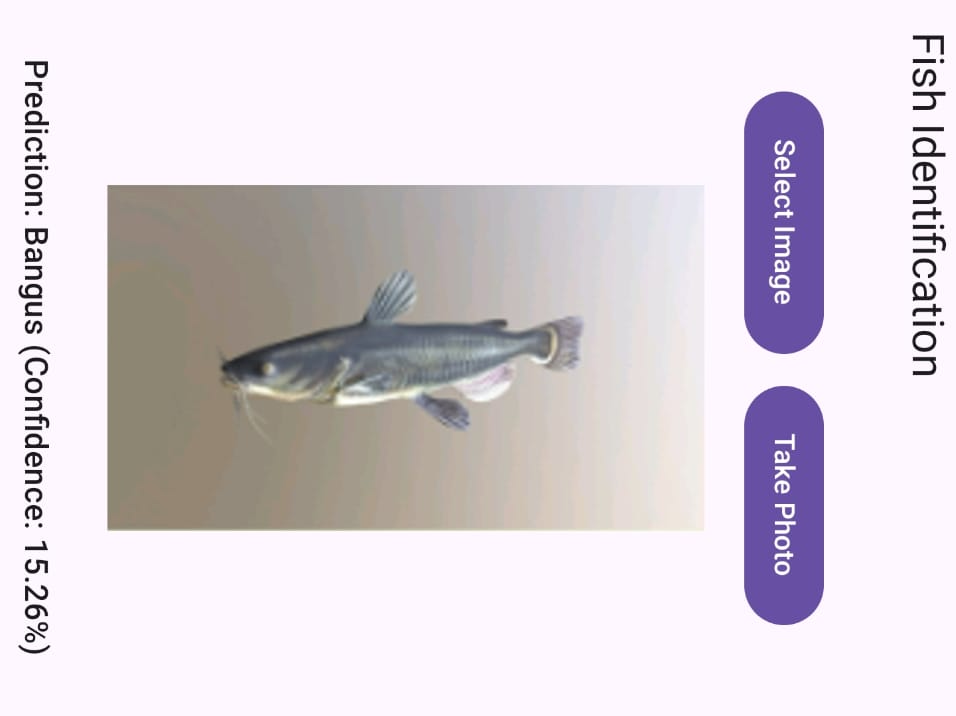

# SMART FISH APPLICATION 🐟📱

**SmartFish** is a deep learning-powered Android application designed to help users—especially new or inexperienced fish buyers—make informed decisions about the fish they intend to purchase. Using transfer learning and image classification techniques, the app identifies fish species, evaluates their health, provides nutritional facts, estimates market value, and determines the fish's natural habitat (ocean, sea, or pond).

## 🧠 Powered by AI

This application employs pre-trained convolutional neural networks (CNNs) like **MobileNetV3** or **EfficientNet**, fine-tuned using a curated dataset of fish images. These models are optimized using **TensorFlow Lite** for efficient inference on mobile devices.

---

## ✨ Key Features

- 🔍 **Fish Identification** – Detects and classifies fish species from camera or gallery images.
- 🌈 **Health & Habitat Analysis** – Evaluates the health status and predicts the habitat (ocean, sea, pond) based on color and visual traits.
- 🍽️ **Nutritional Info** – Displays the nutritional benefits of the identified fish.
- 💰 **Market Price Estimation** – Provides an approximate market price of the fish.
- ⚡ **Lightweight & Fast** – Deployed with TensorFlow Lite for mobile optimization.
- 📊 **Recommendation Dashboard** – Recommends healthy fish choices based on previous interactions and seasonal trends.
- 🔓 **No Login Required** – Designed for instant, barrier-free usage.

---

## 🛠️ Tech Stack

- **Android Studio** (Kotlin/Java)
- **TensorFlow Lite** (for on-device deep learning inference)
- **MobileNetV3 / EfficientNet** (Transfer Learning models)
- **Custom fish image dataset** (for fine-tuning)
- **REST API (optional)** – For cloud-based model predictions (if used)

---

## 📷 How It Works

1. User captures or uploads an image of a fish.
2. The app processes the image using a fine-tuned CNN model.
3. The model predicts:
   - Species name
   - Health status
   - Habitat origin
   - Nutritional benefits
   - Market price
4. The app displays results along with a recommendation dashboard.

---
## 🧪 Testing & Optimization

The **SmartFish** Android application has undergone comprehensive testing to ensure **stability**, **accuracy**, and **real-time responsiveness** across a wide range of Android devices.

### ✅ Devices Used for Testing

- **Android Emulators** – Simulated various screen sizes and operating systems.
- **Physical Devices** – Tested on real smartphones connected via USB.
- Supported Android versions: **Android 5.0 (Lollipop)** and above.

### 🔍 Functional Testing

End-to-end testing was conducted to verify the following workflow:

1. **Image Acquisition** – via device camera or gallery.
2. **Image Pre-processing** – resizing and normalization.
3. **Model Inference** – image classification using TensorFlow Lite.
4. **Metadata Mapping** – species, health status, habitat, and nutritional info.
5. **Output Display** – presenting results on the user interface and dashboard.

### ⚙️ Performance Testing

- **Inference Time**: Averaged between **100 ms to 300 ms** on mid-range Android devices.
- **Memory Usage**: Optimized to ensure minimal resource consumption, even on devices with limited RAM.
- **Responsiveness**: The app runs smoothly without noticeable lag under typical usage conditions.

These optimizations make the app suitable for deployment in real-world environments, especially where hardware resources are constrained.

## 📸 Screenshots

### Home Dashboard

### Prediction Result

---

## 📂 Project Structure

- `/app` – Android app source code
- `/model` – TensorFlow Lite model & scripts
- `/assets` – Image and data assets (if any)
- `/docs` – Documentation and design details

---

## 🧪 Evaluation

- The model was tested on various fish image scenarios with high accuracy.
- Performance was benchmarked on mobile devices for real-time results.

---

## 📢 Future Enhancements

- 📦 Offline prediction mode
- 🛍️ Integration with e-commerce or market listings

---

## 🤝 Contributions

Pull requests and suggestions are welcome! If you have ideas for new features or improvements, feel free to open an issue.

---

## 📜 License

This project is licensed .

---

## 🙋‍♀️ About the Developer

Developed by [Madhuri-179](https://github.com/Madhuri-179), this project explores the intersection of AI, mobile computing, and consumer utility—specifically for promoting smarter, healthier food choices.

---
